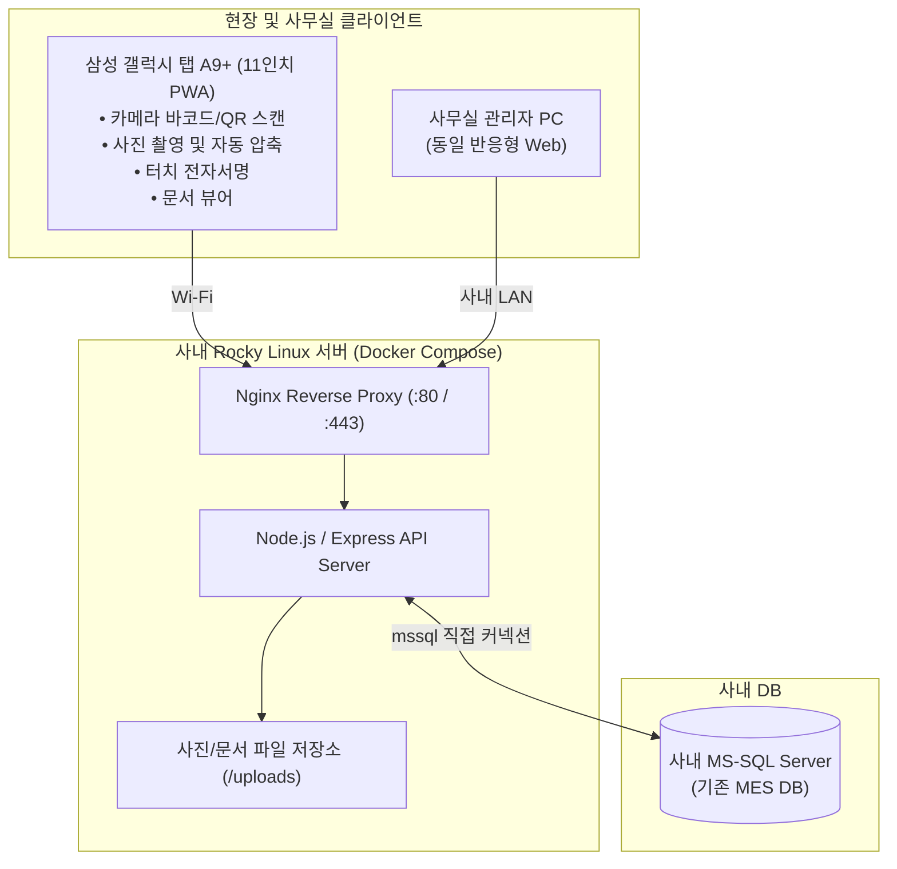
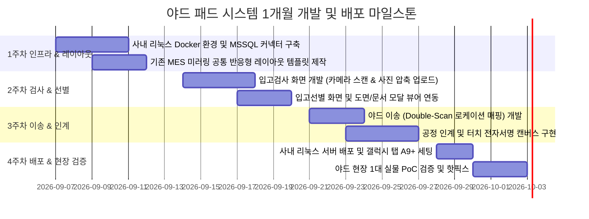

# [기획/설계] 야드 현장 업무용 패드 웹 시스템 (Yard Pad MES)

야드 현장의 4대 핵심 업무(**입고검사, 입고선별, 이송, 인계**)를 모바일 패드 1대로 1개월 내 PoC 테스트 배포하고, 사무실 PC에서도 동일하게 관리할 수 있도록 기존 MES 화면을 1:1 미러링한 반응형 PWA(웹) 시스템의 상세 기획 및 개발 구현 계획입니다.

---

## 1. 확정된 시스템 환경 및 아키텍처

| 구분 | 확정 사양 | 기술적 특징 및 고려 사항 |
| :--- | :--- | :--- |
| **타깃 디바이스** | **삼성 갤럭시 탭 A9+** (11인치, 1920x1200, 16:10) *(추후 대화면 패드 및 PC 확장)* | • 기본 가로 모드 중심 설계 • Flexbox/Grid 기반 유동형 반응형 레이아웃으로 11인치부터 14인치 이상 및 PC 모니터까지 왜곡 없이 자동 대응 |
| **클라이언트** | **반응형 모바일 PWA (Web)** | • 브라우저 주소창 없는 전체화면(Standalone) 구동 • 카메라 바코드/QR 실시간 스캔 (`html5-qrcode`) • 현장 사진 실시간 촬영 및 **브라우저단 자동 압축(Canvas Resize)** • 인계 시 터치 전자서명 캔버스 (`signature_pad`) • 도면 및 사양서 내장 PDF/이미지 모달 뷰어 |
| **서버 인프라** | **사내 Rocky Linux 서버 (Docker Compose)** | • Nginx 리버스 프록시 + Web 정적 서빙 • REST API 백엔드 컨테이너 (Node.js / Express 또는 Fastify) • 촬영 사진 및 첨부파일 영구 보존 로컬 볼륨 마운트 |
| **데이터베이스** | **사내 Rocky Linux 설치 MS-SQL (MSSQL)** | • Node.js `mssql` 드라이버 기반 실시간 커넥션 풀 구축 • 기존 MES 테이블/뷰 실시간 직접 조회 및 트랜잭션 CRUD 반영 |
| **네트워크** | **야드 현장 Wi-Fi** | • Wi-Fi 신호 상태 모니터링 뱃지 (온라인/오프라인) • 일시적 연결 지연/끊김 시 자동 재시도 및 중복 전송 방지(Idempotency) 로직 |

---

## 2. 화면 UI/UX 전략 (기존 MES 미러링 & 패드 터치 최적화)

사용자 숙련도 향상과 개발 기간 단축을 위해, 기존 PC용 MES의 **「조회 툴바 + 마스터 그리드 + 디테일 폼」**의 표준 구조를 그대로 차용하되, 현장 터치 편의성을 대폭 강화합니다.

### 2.1 공통 레이아웃 구조 (11인치 가로 모드 기준)
* **상단 헤더 (50px)**: 시스템 명칭, 4대 업무 전환 탭([입고검사], [입고선별], [이송], [인계]), 작업자명(로그인 계정), Wi-Fi 통신 상태 뱃지
* **검색 조건 바 (55px)**:
  * 입고일자(From~To), 공급처 선택, 품번/LotNo 입력 필드
  * **[조회]**, **[초기화]**, 그리고 언제나 즉각 호출 가능한 **[📷 바코드 스캔]** 플로팅/고정 버튼
* **본문 메인 영역 (좌우 2분할 마스터-디테일)**:
  * **좌측 (60%) - 마스터 그리드**:
    * 기존 MES 표와 동일한 컬럼 순서 (발주번호, 품번, 품명, 규격, 예정수량, 검사상태 등)
    * **터치 친화 행 높이**: 손가락 터치가 빗나가지 않도록 최소 행 높이 `48px` 적용
    * 바코드 스캔 시 해당 품목이 그리드 상에서 즉시 하이라이트되며 우측 디테일 폼에 자동 로딩
  * **우측 (40%) - 디테일 입력 & 액션 패널**:
    * 선택 품목 상세 스펙 표시
    * 작업 수량(검사수량/양품/불량 등) 입력 (터치 숫자 키패드 팝업 또는 대형 인풋)
    * 판정 원터치 토글: **[ 합격(양품) ]** / **[ 불합격 ]**
    * **[📷 사진 촬영]** 버튼: 불량 또는 실물 사진 촬영 시 즉각 썸네일 프리뷰 표시 (최대 5장)
    * **[📄 도면/문서]** 버튼: 클릭 시 해당 품목의 도면/밀시트 PDF 팝업 표출
    * 하단 대형 액션 버튼: **[전체 합격]**, **[임시 저장]**, **[확정/MES 전송]**

---

## 3. 4대 핵심 업무 프로세스 상세 정의

### [1] 입고검사 (Arrival Inspection)
1. **조회 및 매칭**: 공급사 납품 품목 목록 조회 또는 입고 자재 바코드/QR 스캔
2. **문서 확인**: 필요 시 [도면/규격서] 버튼을 눌러 품질 기준 문서 즉시 열람
3. **검사 수행**:
   * 검사 수량 및 합격/불합격 판정
   * 불합격 시 불량 유형(외관 스크래치, 치수 불량, 이물질 등) 코드 선택
   * **패드 카메라로 불량 부위 실시간 촬영 첨부** (서버 저장 및 MES 연계)
4. **검사 확정**: MSSQL 입고검사 테이블에 판정 결과 업데이트 -> '입고선별 대기' 또는 '합격 입고'로 상태 전이

### [2] 입고선별 (Sorting & Grading)
1. **대상 조회**: 검사 대기 또는 조건부 합격/선별 지정된 Lot 품목 조회
2. **수량 분할**:
   * 총 입고 수량 중 [양품 수량], [불량 수량], [재작업 수량] 분할 기입
3. **등급 및 판정**: 등급(A/B/C 등) 부여 및 선별 작업자/시간 기록
4. **선별 확정**: 분할된 수량에 맞춰 차기 로케이션(야드 보관 또는 반품장) 지정

### [3] 야드 이송 (Yard Transfer & Location Mapping)
1. **이송 대상 선택**: 하역장 대기 자재 또는 야드 내 재배치 품목 조회
2. **Double-Scan 매핑**:
   * Step 1: 이송할 자재의 바코드/QR 스캔
   * Step 2: 이동할 야드 바닥/기둥의 **로케이션 바코드/QR(예: YD-A-01)** 스캔
3. **위치 매핑 완료**: MSSQL 재고 마스터 테이블의 현재 위치(`LOCATION_CODE`)가 실시간으로 갱신

### [4] 공정/물류 인계 (Handover)
1. **인계 대상 목록 작성**: 생산 라인 투입 또는 후속 부서(가공/물류)로 넘길 자재 리스트업
2. **실물 인계 대조**: 패드로 인계 품목 바코드를 차례로 스캔하여 실물과 수량 대조 검수
3. **디지털 전자서명**: 패드 화면의 서명 패드(Sign-Pad) 영역에 **인수자가 직접 터치펜/손가락으로 서명 날인**
4. **인계 완료**: 서명 이미지와 함께 인계 완료 전산 처리 -> MES 자재 상태가 '공정 투입 완료'로 확정

---

## 4. 백엔드 및 MS-SQL 인터페이스 구조 설계안

기존 MES의 컬럼 명세가 도착하기 전이라도 즉시 개발에 착수할 수 있도록, 표준 MES 인터페이스 뷰(View) 및 테이블 규격을 사전 정의합니다. (추후 제공해주실 실제 컬럼명과 1:1 매핑 예정)

* **입고/발주 조회 뷰**: `VW_YARD_INBOUND_LIST` (발주번호, 품번, 품명, 공급사, 입고예정일, 규격, 수량 등)
* **검사 결과 반영**: `TB_YARD_INSP_RESULT` (검사일시, 검사원, 합격수량, 불량수량, 불량코드, 사진경로 등)
* **선별 결과 반영**: `TB_YARD_SORT_RESULT` (선별일시, 양품수량, 불량수량, 재작업수량, 등급 등)
* **야드 재고/위치 이송**: `TB_YARD_STOCK_LOC` (자재ID, 현재로케이션, 변경로케이션, 이송일시, 작업자)
* **인계 및 전자서명**: `TB_YARD_HANDOVER` (인계번호, 인수자, 서명이미지경로, 인계일시, 상태)

---

## 5. 1개월(4주) 주차별 실행 계획

* **1주차**:
  * 사내 Rocky Linux 서버 내 Docker Compose 인프라 셋업 (Nginx + Node.js API)
  * MSSQL 데이터베이스 커넥션 풀 구축 및 연결 테스트
  * 갤럭시 탭 A9+ 해상도에 최적화된 공통 반응형 프론트엔드 템플릿(상단 툴바 + 2분할 레이아웃) 구축
* **2주차**:
  * **[입고검사]** 기능: 발주 조회, 카메라 바코드/QR 스캐너 연동, 검사 수량 입력 및 불합격 판정
  * **실시간 사진 촬영 및 Canvas 압축 업로드** 파이프라인 개발
  * **[입고선별]** 기능: 수량 분할(양품/불량/재작업), 등급 지정, 도면/문서 팝업 뷰어 연동
* **3주차**:
  * **[야드 이송]** 기능: 자재 스캔 -> 로케이션 스캔 매핑 및 MSSQL 실시간 위치 업데이트
  * **[공정 인계]** 기능: 인계 대상 검수 및 **터치 전자서명(Signature Pad)** 캔버스 개발
  * 4대 업무 전체 트랜잭션 검증 및 예외 처리
* **4주차**:
  * 사내 Rocky Linux 서버에 최종 컨테이너 배포
  * **삼성 갤럭시 탭 A9+에 PWA 설치(홈 화면 바로가기 추가)** 및 현장 Wi-Fi 접속 테스트
  * 실제 자재 1대를 대상으로 입고검사~인계 전 과정 **현장 실물 PoC 검증** 수행 및 피드백 반영
