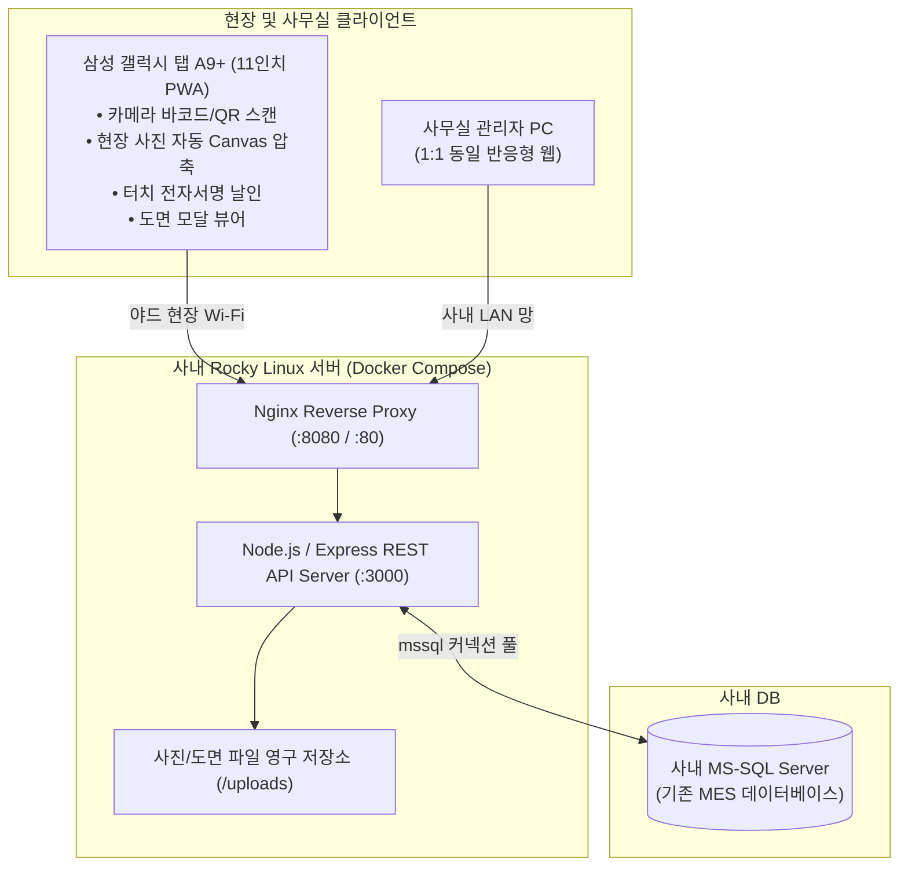

# 야드 현장 업무용 패드 웹 시스템 (Yard Pad MES)

> **삼성 갤럭시 탭 A9+ (11인치, 1920x1200) 및 PC 환경에 최적화된 야드 4대 핵심 업무 반응형 PWA 시스템**

---

## 📌 1. 프로젝트 개요

**Yard Pad MES**는 조선/플랜트/제조 야드 현장의 4대 핵심 업무(**입고검사, 입고선별, 야드 이송, 공정 인계**)를 모바일 패드 1대로 현장에서 신속하고 정확하게 처리하고, 사무실 PC에서도 기존 MES 화면을 1:1 미러링하여 실시간 관리할 수 있도록 설계된 차세대 현장 반응형 PWA(Web) 시스템입니다.

---

## 🏗️ 2. 시스템 아키텍처



---

## ✨ 3. 4대 핵심 업무 기능

| 업무 구분 | 주요 기능 및 현장 최적화 UX |
| :--- | :--- |
| **🔍 [1] 입고검사**<br/>(Arrival Inspection) | • 발주 목록 조회 및 자재 바코드/QR 카메라 즉시 스캔 매칭<br/>• 검사 수량 입력 및 합격/불합격 원터치 토글<br/>• **현장 불량 사진 실시간 촬영 및 Canvas 자동 압축(10MB ➔ 200KB)** 업로드<br/>• 자재 품질 규격서 및 도면 원터치 열람 |
| **📊 [2] 입고선별**<br/>(Sorting & Grading) | • 조건부 합격 및 선별 대상 품목 실시간 로딩<br/>• 총수량 대비 [양품 / 불량 / 재작업 수량] 분할 기입<br/>• 품질 등급(A/B/C) 부여 및 차기 저장 로케이션 지정 |
| **🔄 [3] 야드 이송**<br/>(Double-Scan Mapping) | • **Step 1:** 이동할 자재 바코드/QR 스캔<br/>• **Step 2:** 이동 목적지 야드 바닥/기둥의 로케이션 바코드(예: YD-A-01) 스캔<br/>• 사내 MS-SQL 재고 위치(`LOCATION_CODE`) 실시간 즉시 갱신 |
| **✍️ [4] 공정/물류 인계**<br/>(Handover & Signature) | • 라인 투입 및 물류 부서 인계 대상 자재 검수 체크<br/>• 패드 화면 상에서 **인수자가 터치펜/손가락으로 전자서명 날인**<br/>• 서명 이미지 서버 영구 보관 및 전산 투입 완료 확정 |

---

## 🛠️ 4. 기술 스택

* **Frontend (PWA)**:
  * Vanilla HTML5, CSS3, ES6+ JavaScript
  * `html5-qrcode`: 카메라 바코드 및 2D QR 코드 실시간 스캔
  * HTML5 Canvas: 사진 고속 압축 및 터치 전자서명 패드
  * Service Worker & Web App Manifest: PWA Standalone 전체화면 구동
* **Backend**:
  * Node.js, Express.js
  * `mssql`: 사내 MS-SQL Server 커넥션 풀 및 트랜잭션 처리 (기존 MES DB 직접 연동)
  * `multer`: 현장 사진 및 도면 업로드
* **Infrastructure**:
  * Docker & Docker Compose
  * Nginx Reverse Proxy (Gzip 압축 및 정적 리소스 캐싱)

---

## 🚀 5. 실행 및 배포 가이드

### 5.1 로컬 개발 환경 실행
```bash
# 1. 의존성 설치
cd server
npm install

# 2. 서버 실행
npm start
# 또는 핫리로드 개발 모드
npm run dev

# 3. 브라우저 접속
# http://localhost:3300
```

### 5.2 사내 Rocky Linux 서버 Docker Compose 배포
```bash
# 환경 설정 복사 및 MS-SQL 접속 정보 기입
cp .env.example .env
vi .env

# 도커 컴포즈 컨테이너 일괄 빌드 및 백그라운드 구동
docker compose up -d --build

# 서비스 상태 확인
docker compose ps
```

---

## 📁 6. 프로젝트 디렉터리 구조

```text
yard_pad_MES/
├── AGENTS.md                          # AI Agent 지침서 및 규칙
├── README.md                          # 프로젝트 안내서
├── implementation_plan.md             # 프로젝트 실행 계획서
├── docker-compose.yml                 # Docker Compose 배포 구성
├── .env.example                       # 환경 변수 템플릿
├── .gitignore                         # Git 제외 설정
├── HISTORY/                           # 개발 및 기획 이력 관리
│   ├── INDEX.md
│   ├── Implementation Plan_20260906-01.md
│   ├── Walkthrough_20260906-01.md
│   └── Implementation Plan_20260907-01.md
├── nginx/                             # Nginx 리버스 프록시 설정
│   └── nginx.conf
├── server/                            # Node.js REST API 백엔드
│   ├── Dockerfile
│   ├── package.json
│   ├── uploads/                       # 사진/도면 저장소
│   └── src/
│       ├── app.js
│       ├── config/                    # DB 및 Multer 설정
│       └── routes/                    # 4대 업무별 라우터
└── client/                            # 반응형 모바일 PWA 웹 프론트엔드
    ├── index.html
    ├── manifest.json
    ├── sw.js
    ├── css/
    └── js/
```
